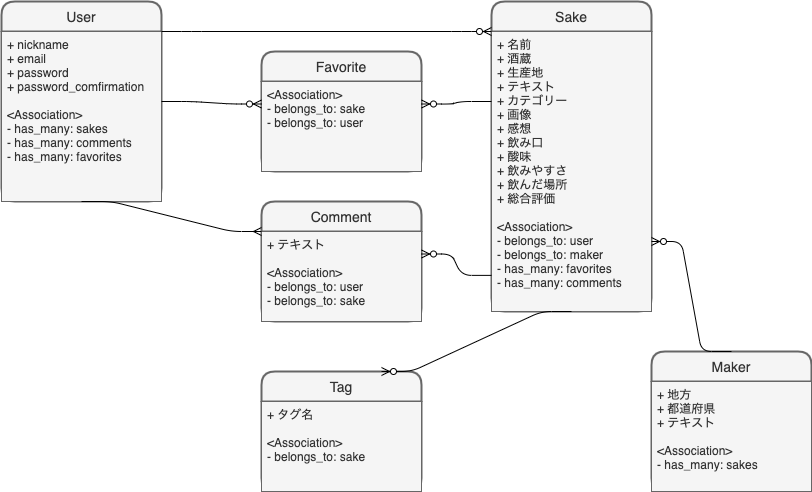

# 僕の私の酒図鑑

## アプリケーション概要
  このアプリでは、飲んだお酒の情報を登録することができます。また他の人の投稿を見て、次のお酒を見つける手助けをすることもできるでしょう。

## URL

## テスト用アカウント

## 利用方法
  お酒を飲んだら、このアプリに登録しましょう。また、情報を追加し図鑑を完成させましょう。
## 目指した課題解決
  このアプリは、私や同じような人が日本酒の味を記憶していないという問題を解決するために開発されました。日本酒が好きで飲むのですが、飲んだという記憶はあれどどんな味だったか、何と合わせたら美味しかったか全くと言っていいほど覚えていません。酔った時の記憶とは当てにならないものです。そこで、味をメモする場所を提供しようとこのアプリを開発しました。

## 洗い出した用件
  ユーザー  機能 | 登録/編集/削除
  酒       機能 | 登録/編集/削除
  メモ　　  機能 | 登録/削除
  コメント  機能 | 登録/削除
  お気に入り機能 | 登録/削除
  ソート機能
  メモ完成チェック
  マイページ

## 実装した機能についてのGIFと説明

## 実装予定の機能

## データベース設計
  
## ローカルでの動作方法